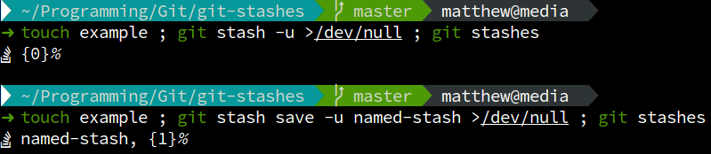

Git Stashes
-----------

This lists the current stashes. This requires [nerd-fonts](https://github.com/ryanoasis/nerd-fonts) to display the stash icon.

This can be used to list your current stashes in your terminal prompt.

Install
-------

```
antigen-bundle matthewfranglen/git-stashes
```

Example
-------


